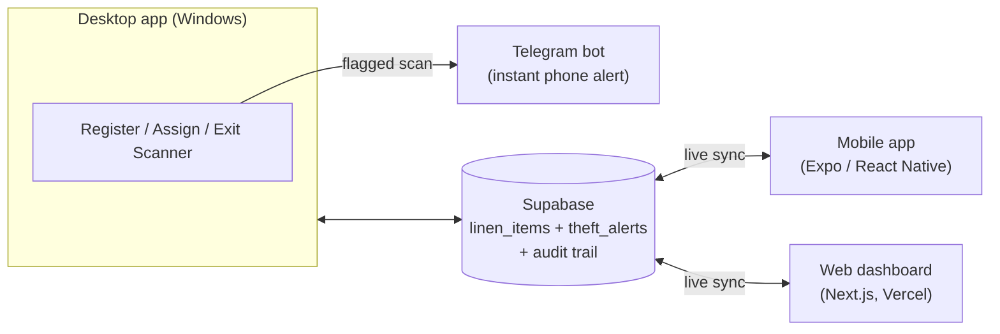

# Linen RFID Detection System

A theft-detection system for hotel/hospitality linen (towels, bedsheets,
robes) built around real RFID scanning. A desktop app, wired up to a
physical UHF RFID reader, registers linen items to customers and rooms,
flags anything that passes an exit scanner while still checked out to a
guest, and alerts staff instantly - on-screen, on Telegram, live on a
companion mobile app, and live on a web dashboard.

The desktop app drives one physical scanner through a Register / Assign
to Guest / Exit Scanner mode toggle - what a tag read means depends on
which mode is currently selected, since there's only one scanner. See
[`linen_detection_system/README.md`](linen_detection_system/README.md)
("Hardware setup") for exactly how a real reader is wired in, including
what to do if your specific reader unit doesn't accept the plain UHF
protocol.

## How it works

- **Register items** - scan a tag, assign it to a customer and room; it's saved as **In Use** (or left unassigned as **Storage** stock)
- **Track lifecycle** - items move between **In Use**, **Laundry**, and **Storage** as they're picked up, washed, and returned to stock
- **Catch theft** - scanning a tag at the exit while it's still **In Use** triggers an alert; items properly in **Laundry** or **Storage** pass through without one
- **Alert everywhere at once** - an on-screen pop-up, a Telegram message, and a live-updating alert on the mobile app and web dashboard all fire from the same event
- **Stay in sync** - all three apps read and write the same Supabase tables, so a scan on the desktop shows up on the phone and the web dashboard within seconds - the dashboard even shows which Scanner Mode the desktop app is currently in, live
- **Audit everything** - every registration, edit, status change, deletion, and alert trigger/dismissal is recorded in an audit trail, viewable on the mobile app and web dashboard
- **Stay locked down** - the mobile app and web dashboard both require a login, and Row Level Security (with staff/admin roles) means the shared data can't be read or written without one. The desktop app, as a trusted internal tool, authenticates as a privileged Supabase role instead of having its own login screen.

## Project structure

| Folder | What it is |
|---|---|
| [`linen_detection_system/`](linen_detection_system/) | The desktop app - Python + Tkinter. Where the physical scanner is actually plugged in; scanning, assigning, and exit-scan detection all happen here. |
| [`linen-mobile-app-v2/`](linen-mobile-app-v2/) | The mobile companion app - Expo + React Native. A live dashboard: stats, rooms/categories, real-time theft alerts, and an audit trail. |
| [`linen-web-dashboard/`](linen-web-dashboard/) | The web dashboard - Next.js, deployed on Vercel. Browser-based live view of the same data (inventory, alerts, activity, admin), plus a live "what's the desktop scanner doing" status badge. Read-only for scanning - see its README for why it doesn't drive the hardware itself. |

Each folder has its own README with full setup instructions - this
file is the overview; start there for the details of running any app.
[`ARCHITECTURE.md`](ARCHITECTURE.md) has a deeper technical teardown
(data flow, security tradeoffs) - useful background, though the
per-app READMEs are the current source of truth for what's actually
implemented.

## Tech stack

- **Desktop:** Python 3.12+, Tkinter (GUI), `supabase-py`, `pyserial` (real RFID hardware)
- **Mobile:** Expo (React Native, SDK 54), TypeScript, `expo-router`, `@supabase/supabase-js`
- **Web:** Next.js (App Router), TypeScript, Tailwind CSS, `@supabase/supabase-js`, deployed on Vercel
- **Backend:** [Supabase](https://supabase.com) (Postgres + Auth + Realtime) - shared by all three apps
- **Alerts:** Telegram Bot API

## Getting started

1. Set up the shared Supabase project (table schema + credentials) - see the **Supabase setup** section in [`linen_detection_system/README.md`](linen_detection_system/README.md)
2. Run the desktop app - see [`linen_detection_system/README.md`](linen_detection_system/README.md)
3. Run the mobile app - see [`linen-mobile-app-v2/README.md`](linen-mobile-app-v2/README.md)
4. Run the web dashboard - see [`linen-web-dashboard/README.md`](linen-web-dashboard/README.md)

## Status

Working end to end: registering items via a real RFID scanner, the
full In Use / Laundry / Storage lifecycle, exit-scan detection,
Telegram alerts, live theft alerts and inventory synced across the
mobile app and web dashboard via Supabase Realtime (with history),
an audit trail of every action, staff/admin role-based permissions,
mobile login/signup with password reset and per-account settings, and
Row Level Security protecting the shared data.

Not yet built:
- Real push notifications on mobile (needs a development build via
  EAS and an Apple Developer account - Expo Go can't receive remote
  push anymore)
- Multi-property support (see `ARCHITECTURE.md` for the
  `organization_id` design this would use)
