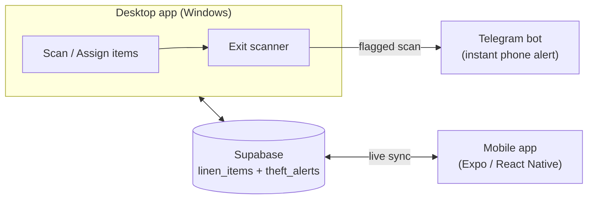

# Linen RFID Detection System

A theft-detection system for hotel/hospitality linen (towels, bedsheets,
robes) built around simulated RFID scanning. A desktop app registers
linen items to customers and rooms, flags anything that passes an exit
scanner while still checked out to a guest, and alerts staff instantly
- on-screen, on Telegram, and live on a companion mobile app.

There's no physical RFID hardware yet - scanning is simulated through
the desktop app's UI, standing in for what a real RFID reader would
report (a tag ID, and eventually item metadata encoded on the tag
itself). Everything downstream of that - the data model, the
theft-detection rule, the alerting pipeline - is built to work exactly
the same way once real readers are wired in.

## How it works

- **Register items** - simulate a scan, assign it to a customer and room; it's saved as **In Use**
- **Track lifecycle** - items move between **In Use**, **Laundry**, and **Storage** as they're picked up, washed, and returned to stock
- **Catch theft** - scanning a tag at the exit while it's still **In Use** triggers an alert; items properly in **Laundry** or **Storage** pass through without one
- **Alert everywhere at once** - an on-screen pop-up, a Telegram message, and a live-updating alert on the mobile app all fire from the same event
- **Stay in sync** - both apps read and write the same Supabase tables, so a scan on the desktop shows up on the phone within seconds
- **Stay locked down** - the mobile app requires a login, and Row Level Security means the shared data can't be read or written without one. The desktop app, as a trusted internal tool, authenticates as a privileged Supabase role instead of having its own login screen.

## Project structure

| Folder | What it is |
|---|---|
| [`linen_detection_system/`](linen_detection_system/) | The desktop app - Python + Tkinter. Where scanning, assigning, and exit-scan detection actually happen. |
| [`linen-mobile-app-v2/`](linen-mobile-app-v2/) | The mobile companion app - Expo + React Native. A live dashboard: stats, rooms/categories, and real-time theft alerts. |

Each folder has its own README with full setup instructions - this
file is the overview; start there for the details of running either
app.

## Tech stack

- **Desktop:** Python 3.12+, Tkinter (GUI), `supabase-py`
- **Mobile:** Expo (React Native, SDK 54), TypeScript, `expo-router`, `@supabase/supabase-js`
- **Backend:** [Supabase](https://supabase.com) (Postgres + Realtime) - shared by both apps
- **Alerts:** Telegram Bot API

## Getting started

1. Set up the shared Supabase project (table schema + credentials) - see the **Supabase setup** section in [`linen_detection_system/README.md`](linen_detection_system/README.md)
2. Run the desktop app - see [`linen_detection_system/README.md`](linen_detection_system/README.md)
3. Run the mobile app - see [`linen-mobile-app-v2/README.md`](linen-mobile-app-v2/README.md)

## Status

Working end to end: registering items, the full In Use / Laundry /
Storage lifecycle, exit-scan detection, Telegram alerts, live theft
alerts synced to the mobile app via Supabase Realtime (with history),
mobile login/signup with per-account settings, and Row Level Security
protecting the shared data.

Not yet built:
- Real push notifications on mobile (needs a development build via
  EAS and an Apple Developer account - Expo Go can't receive remote
  push anymore)
- Real RFID hardware, in place of simulated scanning
- Password reset on the mobile app's login screen
